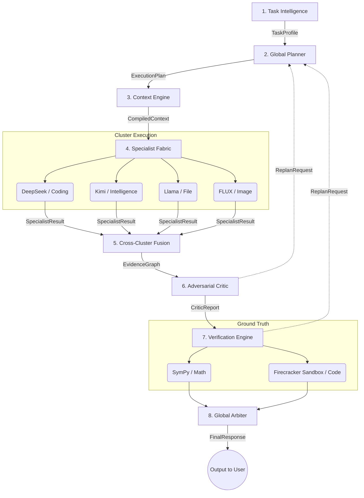

# HAMIA — Hierarchical Adaptive Multi-Model Intelligence Architecture

**Status:** Architecture Specification  
**Source:** HAMIA Architecture Whitepaper (Z.ai, Architecture & Reliability Group)

---

## 1. What HAMIA Actually Is
HAMIA is a **cloud-native fusion system** that orchestrates a federation of specialized frontier models (12+ models) through a rigorous eight-stage pipeline. Instead of training one model to do everything, HAMIA treats each model as an expert consultant whose claims must be corroborated, verified, and weighted before reaching the user.

**Core thesis:** Intelligence at the system level emerges not from any single component, but from the orchestrated interaction of specialized systems working together. The corollary: without rigorous verification, evidence tracing, and adversarial criticism, multi-model ensembles amplify rather than reduce error.

### The Problem It Solves — The Monolithic Model Trap
No single model ranks top-tier on math reasoning, long-context retrieval, code generation, and multimodal synthesis simultaneously. The frontier is a Pareto surface, not a single point. A model asked to do something outside its competence zone won't refuse — it will produce a plausible-sounding but unverified answer. 

## 2. The Eight-Stage Pipeline
Data flows linearly through stages 1–8; control flow is non-linear (stage 7/8 failures can trigger replanning back to stage 2, max 3 rounds).

### Stage Responsibilities
1. **Task Intelligence:** Parse intent, classify complexity (7 axes), assess risk, extract modality requirements.
2. **Global Planner:** Decompose into DAG of subtasks; allocate token/cost budget; assign clusters.
3. **Context Engine:** Hybrid retrieval (vector + BM25 + KG + web); rank; compile context window.
4. **Specialist Fabric:** Dispatch subtasks to clusters in parallel; collect outputs as evidence. *(Asynchronous/Parallel)*
5. **Cross-Cluster Fusion:** Build evidence graph; link claims to sources; detect contradictions.
6. **Adversarial Critic:** Pairwise consistency; cycle detection; red-team re-prompt.
7. **Verification Engine:** External ground truth (SymPy, Code Sandbox, Document retrieval, CLIP).
8. **Global Arbiter:** Weighted synthesis; resolve contradictions; emit calibrated response.

## 3. The Five Design Principles
1. **Specialization over generalization** — route each subtask to the best-suited model.
2. **Verification over self-report** — never accept output as ground truth without independent checks.
3. **Adaptive resource allocation** — spend compute proportional to task complexity/consequence.
4. **Provider-agnostic cloud abstraction** — providers are interchangeable, federated resources.
5. **Evidence-centric synthesis** — every claim cites sources, confidence, and verification status.

## 4. Evidence-Centric Fusion
Naive voting fails: majority may reflect shared training bias, and it discards metadata. HAMIA replaces voting with a structured **Evidence Graph** — a property graph (PostgreSQL + Apache AGE) where nodes are Claims and edges are relationships (supports / contradicts / verifies / sourced_from / derived_from).

Each claim carries: `claim type`, `sources`, `verifications`, `contradictions`, and `effective_confidence` (source confidence adjusted by verification status: verified +0.10, contradicted −0.40, inconclusive ×0.7, timeout ×0.9).

## 5. Threat Model — 8 Failure Modes
| # | Failure | Mitigation |
|---|---|---|
| 1 | Provider outage cascade | Fallback chains, circuit breaker, cross-region federation |
| 2 | Prompt injection via retrieval | Treat retrieved text as data (XML delimiters), sandbox all content |
| 3 | Evidence-graph poisoning | Verification gate, multi-source corroboration for high-stakes |
| 4 | Cost runaway from replanning| Hard budget cap, max 3 replan rounds, degraded-response pathway |
| 5 | Critic over-refusal | Per-tenant sensitivity tuning, "accept with reduced confidence" fallback|
| 6 | Cross-model data leakage | Provider NDAs, training opt-out, DLP scanning |
| 7 | Latency blowup | Parallel verifier dispatch, pre-warmed sandbox pool, 5s verifier timeout |
| 8 | Hallucinated verification | Cross-check sandbox with static analyzer, specialist appeal via critic |
